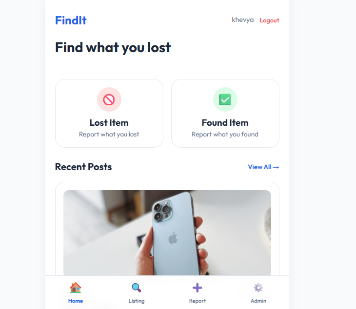
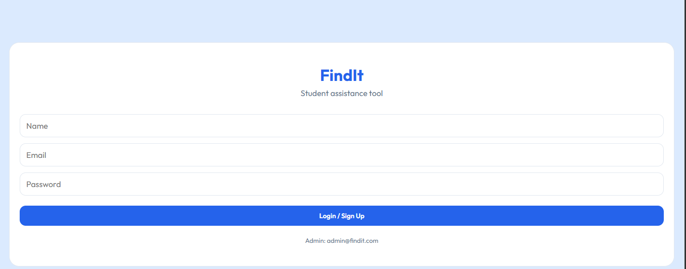

# React + Vite

This template provides a minimal setup to get React working in Vite with HMR and some ESLint rules.

Currently, two official plugins are available:

- [@vitejs/plugin-react](https://github.com/vitejs/vite-plugin-react/blob/main/packages/plugin-react) uses [Babel](https://babeljs.io/) (or [oxc](https://oxc.rs) when used in [rolldown-vite](https://vite.dev/guide/rolldown)) for Fast Refresh
- [@vitejs/plugin-react-swc](https://github.com/vitejs/vite-plugin-react/blob/main/packages/plugin-react-swc) uses [SWC](https://swc.rs/) for Fast Refresh

## React Compiler

The React Compiler is not enabled on this template because of its impact on dev & build performances. To add it, see [this documentation](https://react.dev/learn/react-compiler/installation).

## Expanding the ESLint configuration

If you are developing a production application, we recommend using TypeScript with type-aware lint rules enabled. Check out the [TS template](https://github.com/vitejs/vite/tree/main/packages/create-vite/template-react-ts) for information on how to integrate TypeScript and [`typescript-eslint`](https://typescript-eslint.io) in your project.
# Lost and Found Portal

A simple web-based Lost and Found system where users can report lost and found items easily.

---

## 🚀 Features

- Report lost items
- Report found items
- Simple and clean UI
- Responsive design
- Easy navigation

---

## 🛠 Tech Stack

- HTML
- CSS
- JavaScript
- Vite

---

## 📸 Screenshot





## ⚙️ Installation

```bash
git clone https://github.com/navya27319/lost-and-found.git

cd lost-and-found

npm install

npm run dev
```

---

## 🔮 Future Improvements

- Login/Signup
- Database integration
- Admin panel
- Notifications

---

## 👩‍💻 Author

Made with ❤️ by Navya Sharma
